# 🏙️ Smart City Operations Dashboard


**Live Production:** [https://smart-city-dashboard-gray.vercel.app/](https://smart-city-dashboard-gray.vercel.app/)

A high-performance, data-driven Web GIS dashboard designed to turn complex urban data into actionable insights. Built from the ground up to support enterprise-scale spatial analysis, asset management, and real-time operational monitoring.

This project was developed rapidly using an **AI-Assisted Development / Vibe Coding** approach, combined with rigorous **Spec-Driven Development (SDD)** and **Test-Driven Development (TDD)** to ensure production-level stability under tight timelines.

---

## 📸 Application Gallery & Highlights

### 1. Authentication & Landing Experience
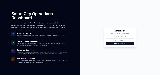
- **Features**: Secure authentication with Google and Guest modes. Clean, modern entry point that introduces the application's core capabilities.
- **Tech Stack**: Next.js App Router, NextAuth.js (Auth.js), Tailwind CSS.

### 2. Dashboard & Real-Time Analytics

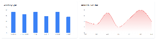
- **Features**: Top-level summary cards tracking total assets, incidents, and system health. Interactive charts visualizing asset distribution and incident trends over time.
- **Tech Stack**: Recharts, Tailwind CSS, Zustand (State Management).

### 3. Advanced Global Search & Filtering
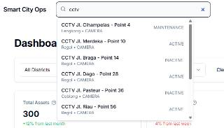

- **Features**: Lightning-fast full-text search with autocomplete dropdown for quick asset lookup. Multi-parameter global filters allowing operations teams to drill down by district, asset type, and status.
- **Tech Stack**: Elasticsearch (Search), Zod (Validation), React Hook Form.

### 4. Data Management & Table View
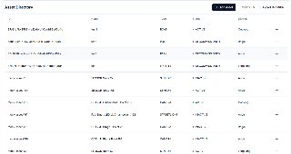


- **Features**: High-performance data table with pagination, allowing efficient browsing of massive datasets. Built-in one-click export functions to download data in CSV or GeoJSON formats for external analysis.
- **Tech Stack**: TanStack Table (React Table), PapaParse (CSV Export), Tailwind CSS.

### 5. Full CRUD Operations & Map Picking
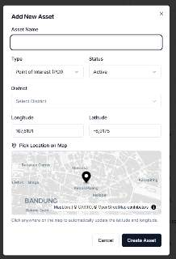
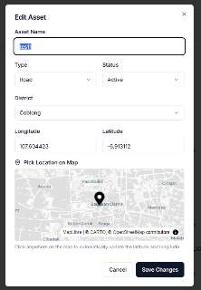

- **Features**: Intuitive "Add", "Edit", and "Delete" modals for seamless data entry and secure data removal. Features an interactive built-in map picker allowing users to easily pinpoint exact coordinate locations visually on the map rather than typing them manually.
- **Tech Stack**: React Hook Form, Zod (Schema Validation), MapLibre GL JS, Zustand.

### 6. Interactive Web GIS & Layers
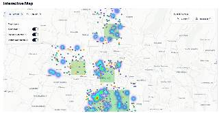
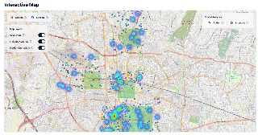
- **Features**: High-performance vector maps rendering thousands of points without lag. Users can seamlessly toggle between Streets and Satellite base maps, and overlay multiple dynamic data layers such as Asset POIs, Incident Heatmaps, and District Choropleths.
- **Tech Stack**: MapLibre GL JS, MapTiler, GeoJSON.

### 7. Spatial Analytics (Buffer & Intersect)
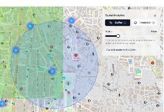
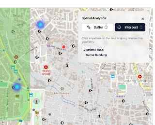
- **Features**: Advanced spatial query tools directly in the browser. **Buffer Analysis** allows drawing dynamic radiuses around assets to find nearby entities. **Intersect Analysis** allows clicking anywhere on the map to identify bounding districts and intersecting geometries.
- **Tech Stack**: Turf.js (Client-side spatial analysis), PostGIS (Backend spatial engine).

### 8. Deep Dive Asset Inspector
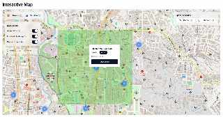
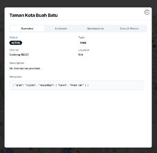

- **Features**: Clicking an asset on the map or table opens a comprehensive detail modal with tabbed navigation. Users can view rich metadata, historical incident logs, maintenance records, and attached media (photos/PDFs).
- **Tech Stack**: Radix UI (Tabs/Dialog), Tailwind CSS, Lucide Icons.

---

## ✨ Complete Feature Showcase

This application is packed with enterprise-grade features, seamlessly integrating a robust data dashboard with advanced Web GIS capabilities.

### 🗺️ Advanced Web GIS & MapLibre Capabilities
- **High-Performance Vector Maps**: Powered by **MapLibre GL JS** and MapTiler, ensuring buttery-smooth panning/zooming even with thousands of points.
- **Dynamic Basemaps**: Easily toggle between **Streets** and **Satellite** views depending on operational needs.
- **Interactive Map Layers**: A dedicated layer control panel allows users to toggle:
  - **Asset POIs**: Point markers clustered dynamically for performance.
  - **Incident Heatmap**: Visual density of reported incidents across the city.
  - **District Choropleth**: Color-coded polygons showing asset density by district.
- **Spatial Analytics (PostGIS & Turf.js)**:
  - **Buffer Analysis**: Select an asset and instantly draw a dynamic radius (e.g., 500m) to analyze the impact area.
  - **Intersect Operations**: Analyze and highlight assets that fall within specific boundaries or geometric intersections.
- **Interactive Point Selection**: Clicking an Asset POI on the map triggers a fly-to animation and opens a rich detail modal containing images, PDF reports, and historical data.

### 📊 Dashboard & Data Visualization
- **Real-Time Summary Cards**: Top-level metric cards displaying Total Assets, Active Incidents, and System Health.
- **Interactive Charts (Recharts)**:
  - **Bar Charts**: Visualizing the distribution of assets by District.
  - **Pie / Donut Charts**: Showing the breakdown of assets by Type and Operational Status.
- **Data Tables with Pagination**: High-performance tabular data views featuring built-in pagination, allowing users to browse massive datasets smoothly.
- **Two-Way Synchronization**: True interactivity—clicking a map marker filters the table and charts, while clicking a row in the table automatically flies the map to the exact coordinates.

### 🛠️ Core Application Operations
- **Advanced Search & Filtering**: Instant full-text search (powered by **Elasticsearch**) and complex multi-parameter data filtering (by Type, Status, District).
- **Full CRUD Operations**: Complete capabilities to **Add**, **Edit**, and **Delete** data seamlessly from the UI with real-time database updates.
- **Comprehensive Data Export**:
  - **PDF Reports**: Auto-generate beautiful PDF documents complete with asset images and structured data.
  - **CSV Export**: Download raw tabular data for spreadsheet analysis.
  - **GeoJSON Export**: Download spatial data directly for use in standard GIS software (like QGIS/ArcGIS).
- **Interactive Guided Tour (Walkthrough)**: A built-in user onboarding experience (using `react-joyride`) that takes new users on a step-by-step tour of the dashboard's features.

---

## 🛠️ Technology Stack

Designed for scalability, this project utilizes a modern Fullstack architecture:

### Frontend
- **React.js & Next.js 14**: Server-Side Rendering (SSR) and App Router for optimal performance and SEO.
- **MapLibre GL JS**: Open-source alternative to Mapbox for rendering complex spatial data.
- **Tailwind CSS & Shadcn/UI**: For a clean, informative, and highly responsive user interface.
- **Zustand**: Lightweight and fast global state management.
- **Recharts**: For rendering robust analytical charts.

### Backend & Database (Microservices Approach)
- **Node.js (Next.js API Routes)**: Serverless backend functions handling API integrations.
- **PostgreSQL + PostGIS**: Primary database handling complex spatial queries and geographic data structures.
- **MongoDB**: Handling unstructured data, metadata, and dynamic survey logs.
- **Redis (Upstash)**: In-memory caching layer to drastically accelerate data fetching and API responses.
- **Elasticsearch (Bonsai)**: Distributed, RESTful search engine for lightning-fast asset lookups.
- **Serverless Architecture Adaptation**: Features a sophisticated client-side Local Storage hydration layer to simulate full CRUD operations on Vercel's read-only file system without requiring a persistent cloud database for demonstration purposes.

---

## 🧪 Engineering Methodology

This project is not just about writing code; it's about shipping reliable software efficiently.

### 1. AI-Assisted Development & Vibe Coding
This dashboard was built by leveraging advanced AI coding tools to dramatically accelerate the development lifecycle. 
- **Antigravity IDE**: The entire project was developed inside the next-generation agentic environment, Antigravity IDE.
- **Powered by Claude & Gemini**: Utilizing state-of-the-art AI models—specifically **Claude Sonnet** and **Gemini 3.1 Pro High**—to draft, refactor, and debug complex Web GIS logic.
- **Spec-Kit by GitHub**: To ensure the AI doesn't hallucinate or deviate from enterprise requirements, the project heavily utilized **Spec-Kit** (developed by GitHub). Spec-Kit enforces rigorous Specification-Driven Development, meaning all architectures, task lists, and tests are meticulously planned and documented before the AI writes a single line of code.
- **Version Control (Git)**: Maintained structured and atomic commits throughout the AI-assisted development process to ensure code traceability and team collaboration readiness.

### 2. Test-Driven Development (TDD)
Every core feature, service, and API endpoint is backed by automated tests.
- **Test Framework**: Jest & React Testing Library.
- **Code Coverage**: Achieved **> 90% Line Coverage** across all files (`services`, `api`, `components`, `hooks`).
- Ensures that rapid development does not sacrifice code quality or introduce regressions.

### 3. Spec-Driven Development (SDD)
The entire project architecture was meticulously documented before writing a single line of code. All features map directly to detailed Specifications (`spec.md`) and Implementation Plans (`plan.md`).

---

## 🚀 Running Locally

Want to run this project on your local machine?

### Prerequisites
- Node.js (v20+)
- Docker & Docker Compose (for local databases)

### Setup Instructions

1. **Clone the repository**
   ```bash
   git clone https://github.com/fadhlanfm/smart-city-dashboard.git
   cd smart-city-dashboard
   ```

2. **Start Local Databases (Docker)**
   This will spin up PostgreSQL (with PostGIS), MongoDB, Redis, and Elasticsearch locally.
   ```bash
   docker-compose up -d
   ```

3. **Install Dependencies**
   ```bash
   npm install
   ```

4. **Environment Variables**
   Copy `.env.example` to `.env.local` and add your MapTiler Key and Auth secrets.

5. **Generate Prisma Client & Seed Data**
   ```bash
   npx prisma generate
   npx prisma db push
   npm run es:setup
   ```

6. **Run the Development Server**
   ```bash
   npm run dev
   ```
   Open [http://localhost:3000](http://localhost:3000) with your browser to see the result.

---

## 👨‍💻 About The Developer

This dashboard was developed to showcase fullstack proficiency, particularly in **Web GIS**, **API Integration**, and **Modern Frontend Architectures**. It perfectly demonstrates the capability to independently build, test, and ship a complex, data-driven dashboard from the ground up within weeks.

*Fast, independent, and adaptable to dynamic requirements.*
